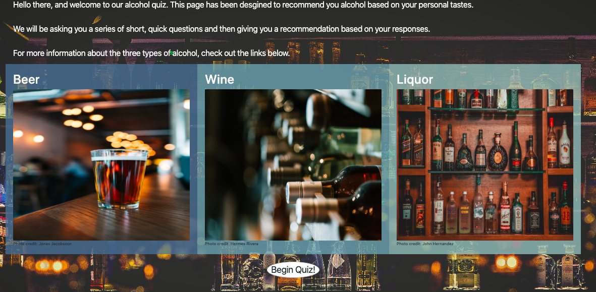

# TomatoTeam Project

<h1>AlcoholFinder<h1>



<h2><u>Overview:</u><h2>
<h4>We have created a quiz to help pair users with alcohol that suits their tastes.
We begin by asking the user if they're 21 or older. If the user is under 21, they are provided an array of non-alcoholic choices.
For users over 21, they are given options of liquor, wine and beer.
For liquor, the user is given the options of several types of liquor to choose from, and from there is given a large assortment of drinks made from that.
For beer and wine, the user is given the option of what type of food they want to pair with their drink. Based off that choice, we give the user drinks that would pair well with their food.</h4>

</br>

<h2><u>The Team:</u></h2>

<h3>Daniel Dolan</h3>
<b>Primary team role:</b> Javascript and Quiz functionality.
</br>
<b>Contributions:</b> Stuff

<h3>Alex Plaetzer</h3>
<b>Primary team role:</b> HTML and CSS styling. 
</br>

<b>Contributions:</b> Stuff

<h3>Diego Rivera</h3>

<b>Primary team role:</b> API calls and HTML and CSS styling.
</br>
<b>Contributions:</b> Stuff
</br>
</br>

<h2><u>What we used:</u></h3>
<h3>Languages:</h3>
<ul>
    <li>HTML</li>
    <li>CSS</li>
    <li>JavaScript</li>
</ul>

Other:

<ul>
    <li>Ajax</li>
    <li>JSON</li>
</ul>

<h3>APIs</h3>
<ul>
    <li>The CocktailDB API for Cocktails - https://www.thecocktaildb.com/</li>
    <li>Spoonacular API for Wine Pairing -https://spoonacular.com/food-api</li>
    <li>The PunkAPI for Beer - https://punkapi.com/</li>
</ul

</br>

<h2><u>Base Objectives:</u></h2>
<ul>
    <li>Ask the user which type of alcholic drink they would like: beer, wine, or cocktail. Then, they will answer one other question based on the alcoholic drink chosen to narrow down the results.</li>
    <li>Have the corresponding API be called based on the choice. </li>
    <li>Return the results to the page in the form of cards. </li>
    <li>An about us page that links to our contact info. </li>
    <li>Make the quiz responsive on smaller/mobile devices. </li>
   
</ul>

</br>

<h2><u>Flex Goals Completed:</u></h2>
<ul>
    <li>Random choices: We added a feature that allows for a random choice in each alcohol type as well as a suprise me that will pick a random alcohol type as well. </li>
    <li>Change the background with the corresponding alcohol type chosen. </li>
   
</ul>

<h2><u>Stretch Goals Future</u></h2>
<ul>
<li>Drink/Food Delivery with Postmates API
Under Construction - we hope to revisit this feature after we learn how to use Node. We ran into a problem while making this in making a request which required a back-end. A fetch request or using Postman would not allow us to dynamically send requests based on the users drink results. </li>
</ul>

</br>

<h2><u>Challenges & Solutions:</u><h2>
<h3>Some of the biggest challenges we faced with this project build included:</h2>

<b>Challenge: Making the quiz change dynamically while also keeping track of the user's choices.</b>
<br>
<b>Solution: We used a class object to keep track of the user's choices and ran a loop based on an array of questions to fill the quiz questions.</b>

<b>Challenge: Finding the right questions that would fit in with what the API provided.</b>
<br>
<b>Solution: We first looked at the documentation of each API before creating our quiz, and we found that type of liquor (vodka, gin, etc.) was best for the CocktailDB and food pairing worked best with the other APIs.</b>

<b>Challenge: The Spoonacular API did not have a random wine request option.</b>
<br>
<b>Solution: We created an array of common wine types and ran a random number generation each time to select a random wine from the array. Then, Spoonacular would provide a wine recommendation based on the type of wine.</b>

</br>

<h2><u>Code Snippets:</u></h2>

<h4>This snippet showcases how we dynamically create fetch parameters using the user's choices.</h4>

```
finCheck() {
      // Method that runs to check if a quiz tree is finished.
      if (parseInt(this.innerTree) > 0) {
        let fetchParam = 0;
        if (questions[this.drinkTree]["qs"][this.innerTree] == "Random") {
          // Checks if the choice on an inner drink tree is random.
          let randomSel = randomNum(
            1,
            questions[this.drinkTree]["qs"]["length"] - 1
          );
          // Generates a random choice in the chosen drink tree
          fetchParam = questions[this.drinkTree]["qs"][randomSel];
        } else {
          // The fetch becomes the choice of the user.
          fetchParam = questions[this.drinkTree]["qs"][this.innerTree];
        }
        // The results div is shown, so the results can fill it.
        $("#results").show();
        $(".navbar").css("margin-bottom", "20px");

```

<br/>

<h4>This snippet shows how we changed from the choice in alcohol to the chosen drink tree.</h4>

```
$("#heading").text(Qans["qs"]["heading"]);
      // Changes the question for the next part of the quiz tree based on choice.
      let quiz = $("#quiz");
      // The quiz display is selected and emptied.
      quiz.empty();
      if (Qans["name"] != "Aged") {
        //Checks if the quiz questions being called are not the initial drink tree questions and appends the drink trees corresponding picture.
        quiz.append(`</img>`);
      }
      for (let i = 1; i <= Qans["qs"]["length"]; i++) {
        //Appends the questions that are in the chosen drink tree based on how many questions there are.
        quiz.append(`<label
        id="q${i}"
        class="element-animation1 btn btn-lg btn-primary btn-block"
        ><span class="btn-label"
          ><i class="glyphicon glyphicon-chevron-right"></i
        ></span>
        <input type="radio" name="q_answer" value="${i}" />${Qans["qs"][i]}</label
      >`);
      }

```

<br />
<h4>This snippet shows how we track the newly placed quiz questions and directs the next questions based on the user's choice.</h4>

```
if (qBase.drinkTree < 1) {
        //Checks if there has been a drink tree chosen yet.
        $("label.btn").on("click", function() {
          var choice = $(this)
            .find("input:radio")
            .val();
          $("#loadbar").show();
          $("#quiz").fadeOut();
          // Animation with a loading bar and hides the quiz while this occurs.
          setTimeout(function() {
            $("#answer").html($(this).checking(choice));
            $("#quiz").show();
            $("#loadbar").fadeOut();
          }, 1500);
          qBase.drinkTree = choice;
          // Changes the drinkTree to what the quiz taker has chosen.
          $("#bg").attr("src", questions[qBase.drinkTree]["backgroundimage"]);
          // Changes the background of the quiz based on the drinkTree chosen. I.e. beer, wine, or liquor.
          $("#credits").html(questions[qBase.drinkTree]["credits"]);
          //Photo credits.
          nextQ(questions[qBase.drinkTree]);
          //Calls the next questions based on the drinkTree chosen.
        });

```

</br>

<h2>Live Demo</h2>
Do we want to do this?
</br>

<h2>Screenshots:</h2>

<h4>Content</h4>
<br />

<h4>Content</h4>
<br />
